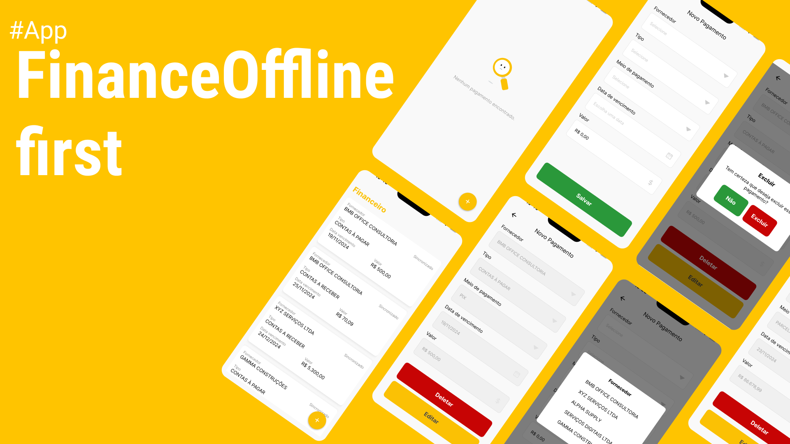

<h1 align="center">Finance-Off-line-First</h1>

## Tomadas de  decisões
Para esse projeto, optei por uma arquitetura baseada em domínios e casos de uso, pois ela oferece uma maneira clara e organizada de estruturar o código, separando a lógica de negócios e a camada de apresentação. Essa abordagem facilita a manutenção e a escalabilidade da aplicação, além de tornar cada funcionalidade mais modular e reutilizável. O app foi projetado para funcionar offline, permitindo ao usuário criar, deletar e editar pagamentos localmente. Os dados são salvos em um banco de dados local e, ao se conectar com a internet, a sincronização com o servidor é feita automaticamente para garantir que as informações estejam sempre atualizadas.

## Tecnologias, libs Utilizadas

- React Native -> (Expo)
- TypeScript
- Axios
- Zustand
- React-hook-form
- Expo SQLite

## Capturas de Tela

---

Desenvolvido por [Fabricio Henrique](https://www.linkedin.com/in/fabricio-26/)
